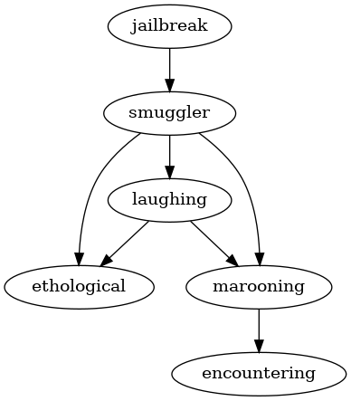

# Challenge 03: Dependencies

It took a while, but [Tux] managed to patch the **firmware** in [Challenge
02](../challenge02) and boot the console computer controlling the [jail].
Using the account information from [Challenge 01](../challenge01), [Tux]
logins and begins exploring the system.

To his chagrin, he sees that the console is an ancient [BSD] machine.
Althought it is painful to use, the fact that the machine is so out of date
actually works in [Tux]'s favor.

Because it is so old, there are a number of unpatched exploits on the system
that will allow for all sorts of nefarious things such as privilege escalation
and of course breaking out of confinement systems such as [jail]s.

[Tux] remembers his time in the [FSF] and recalls his comrades telling him about
a program called, appropriately enough, `jailbreak` that could breakout of a
[jail] using one of a number of exploits.

With excitement, [Tux] downloads the source to `jailbreak` and begins building
the software... only to begin cursing at the machine.  Because the program
tries many different exploits, it is more of a collection of kludgy hacks than
a streamlined application.  As such it has **many** dependencies and building
the program requires building such dependencies before building the
`jailbreak` program itself.

Sighing, [Tux] looks at the `MANIFEST.json` file provided by `jailbreak`
detailing the dependencies and begins the work determining how many
dependencies must be built or installed before he can build `jailbreak` itself.

Such a `MANIFEST.json` looks like this:
    
    {
        "jailbreak": [
            "smuggler"
        ],
        "chroot": [
            "smuggler",
            "laughing",
            "marooning"
        ],
        "leftpad": [
            "smuggler"
        ],
        "sudo": [
            "marooning",
            "ethological",
            "laughing"
        ],
        "figlet": [
            "ethological"
        ],
        "cmatrix": [
            "laughing",
            "marooning"
        ],
        "cowsay": [
            "smuggler"
        ],
        "smuggler": [
            "laughing",
            "ethological",
            "marooning"
        ],
        "laughing": [
            "ethological",
            "marooning"
        ],
        "marooning": [
            "encountering"
        ],
        "ethological": [],
        "encountering": []
    }
    
That is, the file contains a series of packages and a corresponding list of
packages that software depends on.  So in the example above, `jailbreak`
depends on `smuggler`, which in turn depends on `laughing`, `ethological`, and
`marooning`.

- **Part A**: Given the full [MANIFEST.json], determine how many dependencies
  are required by `jailbreak`.
  
    In the sample above, `jailbreak` requires `5` packages (ie. `smuggler`,
    `laughing`, `ethological`, `marooning`, and `encountering`).
    
- **Part B**: Given the full [MANIFEST.json], determine how many
  packages can be built in parallel (that is the **maximum concurrency**).
  Remember, that packages can only be built if all their dependencies have been
  met.
    
    In the sample above, there is a maximum concurrency of `2` because the
    dependency graph looks like this:
    
     
    
## Input

You will be given a full [MANIFEST.json] will all the package dependencies
specified as described above.

## Output

After loading the [MANIFEST.json], output the following information:

    Number of Dependencies: ??
    Maximum Concurrency: ??
    
The first line should be how many dependencies are required by `jailbreak`,
while the second line should be the **maximum concurrency** possible when
building all the packages in the [MANIFEST.json].

[Tux]: https://en.wikipedia.org/wiki/Tux_(mascot)
[jail]: https://en.wikipedia.org/wiki/FreeBSD_jail
[Beastie]: https://en.wikipedia.org/wiki/BSD_Daemon
[hacktoberfest]: https://hacktoberfest.digitalocean.com/
[BSD]: https://en.wikipedia.org/wiki/Berkeley_Software_Distribution
[FSF]: https://www.fsf.org/
[MANIFEST.json]: input.txt
